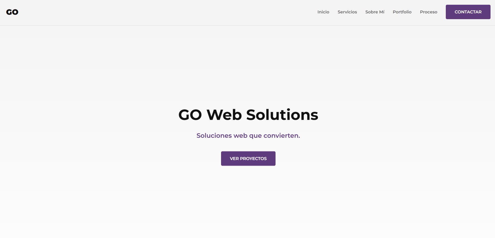

# 🚀 GO Web Solutions - Soluciones Web que Convierten

## Sitio Web Oficial de Gonzalo Orlandoni



**Sitio en Vivo:** [https://gonzaloorlandoni.github.io/go-web-solutions/](https://gonzaloorlandoni.github.io/go-web-solutions/)

---

## 🎯 OBJETIVO: Marca Personal y Portafolio Técnico

Este repositorio aloja el sitio web oficial de **GO Web Solutions**. Funciona como un **Caso de Estudio** integral que demuestra habilidades en diseño UX/UI, desarrollo frontend modular y optimización web. El objetivo es transformar visitantes en clientes mediante una interfaz moderna y performante.

### 🌐 Stack Tecnológico y Habilidades

| Área de Foco          | Implementación Técnica                                                |
| :-------------------- | :-------------------------------------------------------------------- |
| **Arquitectura**      | HTML5 Semántico y **CSS3 Modular** (Variables CSS + Flexbox/Grid).    |
| **Estilos Avanzados** | Uso de **SASS** para proyectos escalables y mantenibles.              |
| **Interactividad**    | JavaScript (ES6+) para manipulación del DOM y lógica de negocio.      |
| **Experiencia (UX)**  | Animaciones **AOS**, navegación fluida y diseño **Fully Responsive**. |
| **Optimización**      | Lazy Loading, SEO técnico y Metadatos Open Graph.                     |

---

## 💼 Proyectos Destacados en el Portafolio

El sitio exhibe una selección estratégica de proyectos que cubren diferentes necesidades del mercado digital actual:

### 1. FitLab (Landing Page)

- **Enfoque:** UX & Conversión (Lead Generation).
- **Descripción:** Landing page de alto impacto visual diseñada para el sector fitness.
- **Key Features:** Carrusel de testimonios, FAQ interactivo y optimización de CTAs.

### 2. Web Corporativa Constructora

- **Enfoque:** Imagen Institucional & Arquitectura CSS.
- **Descripción:** Sitio web multipágina para una empresa de construcción, diseñado para generar confianza y autoridad.
- **Tecnología:** Desarrollado con arquitectura **SASS** para un código CSS limpio y escalable.

### 3. Simulador E-commerce

- **Enfoque:** Lógica de Programación (JavaScript).
- **Descripción:** Aplicación funcional de carrito de compras.
- **Key Features:**
  - Manipulación avanzada del **DOM**.
  - Persistencia de datos con `localStorage`.
  - Cálculo dinámico de precios y totales.

---

## 🛠️ Instalación y Uso Local

Si deseas clonar este repositorio para ver el código fuente:

1.  Clona el repositorio:
    ```bash
    git clone [https://github.com/GonzaloOrlandoni/go-web-solutions.git](https://github.com/GonzaloOrlandoni/go-web-solutions.git)
    ```
2.  Abre el archivo `index.html` en tu navegador o utiliza la extensión **Live Server** de VS Code.

---

### **Desarrollado y Mantenido por Gonzalo Orlandoni.**

_Fundador de GO Web Solutions._
